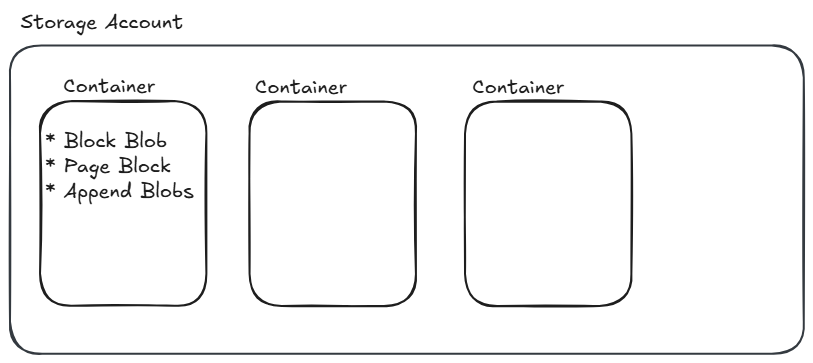

# Develop Solutions that use Blob Storage

## Explore Azure Blob Storage.

* What type of storage solution is Azure Blob Storage, and who provides it?

Azure Blob Storage is **Microsoft's cloud-based object storage solution**, optimized for storing large amounts of unstructured data.

*  How is unstructured data defined, and what are some examples of it?

Unstructured data is **data that does not follow a fixed schema or model**. Examples include text files, images, videos, audio, and binary.

* Why is Blob Storage particularly well-suited for unstructured data?

Blob Storage is designed to **scale massively**, handle diverse data formats, and provide global accessibility via HTTP/HTTPS, making it ideal for storing unstructured data like logs, media, or backups.

* What are some real-world scenarios where Blob storage can be applied?

    * Serving images and documents directly to browsers.
    * Streaming video and audio.
    * Storing log files.
    * Backup, restore, and disaster recovery.
    * Arching data
    * Providing input for data analysis services.

* Which tools or interfaces can developers use to interact with Blob storage?

    * The Azure Storage REST API
    * Azure CLI
    * Azure PowerShell
    * Azure Storage Client libraries (SDKs)

* What is an Azure Storage account, and what role does it play in managing Blob storage?

An Azure Storage account is the top-level container for all Azure Storage services, including Blob storage. It provides a globally unique namespace for your data and enables access over HTTP/HTTPS.

* what are the types of Storage Accounts available?
    * Standard: Recommended for most scenarios.
    * Premium: Offers higher performance by using solid-state drives. Under premium we have:
        * Block blobs
        * Page blobs
        * file shares

### Azure Blob Storage Resource types.

Blob storage offers three types of resources:

* The storage account
* A container in the storage account
* A blob in a container.

### Azure Storage Security Features.

Blob storage offers and recommends to use service-side encryption (sse), however, encryption is also available for Azure Storage libraries from the client.

* Which of the following types of blobs are used to store virtual hard drive files?

    * Page blobs

* Which of the following types of storage accounts is recommended for most scenarios using Azure Storage?

    * General-purpose v2

* What is the maximum size of data that a block blob in Azure Blob storage can store?

    * 190.7 TB

* What are the two versions of client-side encryption available in the Azure Blob Storage and Queue Storage client libraries?

    * Version 1 uses Cipher Block Chaining (CBC) mode with AES and Version 2 uses Galois/Counter Model (GCM) mode with AES