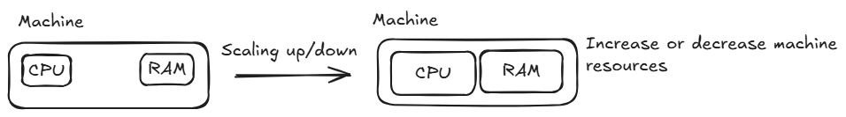
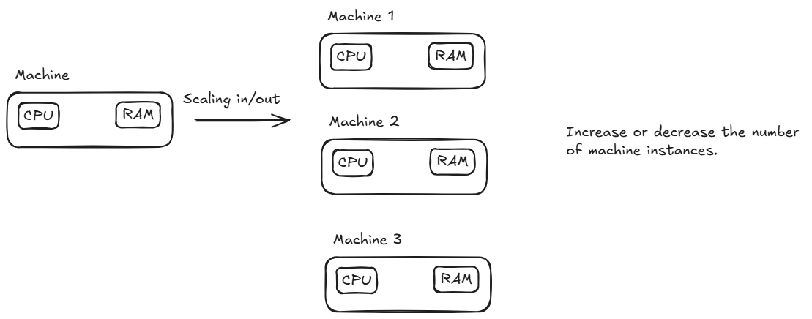
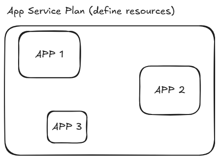

# Implement Azure App Service web apps

## Explore Azure App Service

**What's Azure App Service?**

Azure App Service is an HTTP-based service for hosting web applications, REST APIs, and mobile back ends. Aplications run and scale on both Windows and Linux-based environments.

**Built-in auto scale support**

* Scaling **up/down**: Depending on the usage of the web app, you can scale the resoureces of the underlying machine that is hosting your web app. This includes the number of cores and amount of RAM available.

* Scaling **in/out**: The ability to increase, or decrease, the number of **machine instances** that are running your web app.

**Support for**

* Containers: deploy and run containerized web apps on Windows and Linux. It is possible use private registries like Azure Container Registry or Docker Hub. There is support for multi-container apps, and docker compose for orchestrating container instances.

* deployment slots: deployment slots are live apps with their own host name. App content and configuration elements can be swapped between two deployment slots, including the production slot.

### Limitations

* App service on Linux is not supported on Shared pricing tier.

* The Azureportal shows only features that currently work for linux apps.

* When deployed to built-in images, your code and content are allocated a storage volume for web content, backed by Azure Storage. The disk latency of this volume is higher and more variable than the latency of the container filesystem. Apps that require heavy read-only access to content files might benefit from the custom container option, which places files in the container filesystem instead of on the content volume.

## App Service Plan

An app always runs in an **App Service Plan**. An **App Service Plan** defines a set of compute resorces for a web app to run. One or more apps can be configured to run on the same computing resources (or in the same App Service Plan)

When an **App Service Plan** is created in a certain region, a set of compute resources is created for that plan in that region. Apps within the service plan run on these resources. 

An App Service Plan defines:

* Operating System (Windows, Linux)
* Region
* Number of VM Instances.
* Size of VM instances (Small, Medium, Large)
* Pricing tier (Free, Shared, Basic, ...)

**Note**: In the Free and Shared tiers, an app receives CPU minutes on a shared VM instance and can not scale out. In other tiers, an app runs and scales as follows

* An app runs on all the VM instances configured in the App Service plan.
* If multiple apps are in the same App Service plan, they all share the same VM instances.
* If you have multiple deployment slots for an app, all deployment slots also run on the same VM instances.
* If you enable diagnostic logs, perform backups, or run WebJobs, they also use CPU cycles and memory on these VM instances.

**Note**: All apps run on the VM configured in the Service Plan, so the service plan is the scale unit, if the number of VMs increases, or decreases, in the Service plan, all apps within the Service Plan run on the new number of VMs

**When to isolate an APP?**

Since all apps in a service plan run on the same VMs sometimes it is necessary to consider APP isolation, this is, create a service plan for a specific app. Isolate your app into a new App Service Plan when:

* The app is resource-intensive.
* You want to scale the app independently from the other apps in the existing plan.
* The app needs resource in a different geographical region.

## Deploy to APP Service 

**Automated deployment**

Azure supports automated deployment directly from several sources. 

* **Azure DevOps Services**: You can push your code to Azure DevOps Services, build your code in the cloud, run the tests, generate a release from the code, and finally, push your code to an Azure Web APP.

* **GitHub**: Azure supports automated deployment directly from GitHub. 
* **BitBucket**: Similar to GitHub

**Manual Deployment**

* **Git**:  App Service web apps feature a Git URL that you can add as a remote repository. Pushing to the remote repository deploys your app.

* CLI: `webapp up` is a feature of the `az` command-line interface that packages your app and deploys it. `az webapp up` can create a new App Service web app.

* **Zip deploy**: Use curl or a similar HTTP utility to send a ZIP of your application files to App Service.
* **FTP/S**: FTP or FTPS is a traditional way of pushing your code to many hosting environments, including App Service.

**Continuously deploy code**

If your project designates branches for testing, QA, and staging, then each of those branches should be continuously deployed to a staging slot. This allows your stakeholders to easily assess and test the deployed branch.

**Continuously deploy containers**

* Build and tag the image: As part of the build pipeline, tag the image with the git commit ID, timestamp, or other identifiable information. It’s best not to use the default "latest" tag. Otherwise, it’s difficult to trace back what code is currently deployed, which makes debugging far more difficult.

* Push the tagged image: Once the image is built and tagged, the pipeline pushes the image to our container registry. In the next step, the deployment slot will pull the tagged image from the container registry.

* Update the deployment slot with the new image tag: When this property is updated, the site automatically restarts and pulls the new container image.

## Examples

**Deploy simple api**

In this example a simple API developed with FastAPI is deployed. Click [here](/examples/deploy_simple_api/) for more details.

**Deploy simple api with container**

In this example a simple API is developed with FastAPI, then a docker image is built and pushed to dockerhub. The webapp is created to deploy this app container. For more details click [here](/examples/deploy_container_api/)

