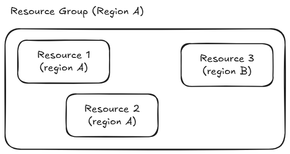

# Resources group

A resource group is a container that holds related resources for an Azure solution. It can include all the resources required for the solution or just a specific subset. Typically, resources that share the same lifecycle are placed in the same resource group, making it easier to deploy, update, and delete them together.

The resource group stores metadata about its resources. The region specified for the resource group determines where this metadata is stored. However, the resources within a resource group can be located in different regions.

## Useful commands with the CLI

**Create a Resource Group**

```bash
az group create --name <rg-name> --location <some-location>
```

**List Resource Groups**

```bash
az group list
```

**Delete a Resource Group**

```bash
az group delete --name <rg-name>
```

**Note**: To delete skipping confirmation.

```bash
az group delete --name <rg-name> --yes --no-wait
```



