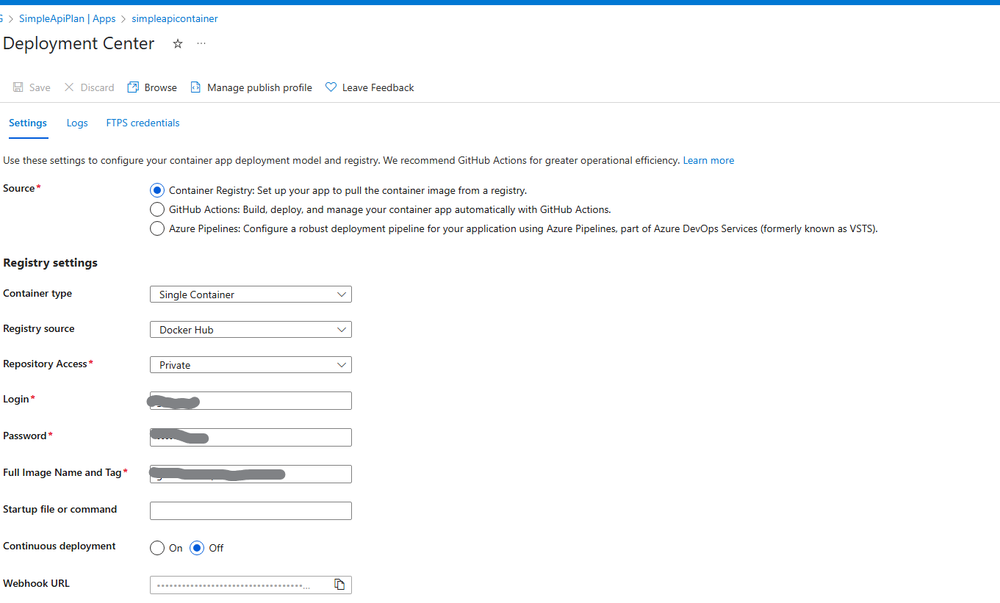
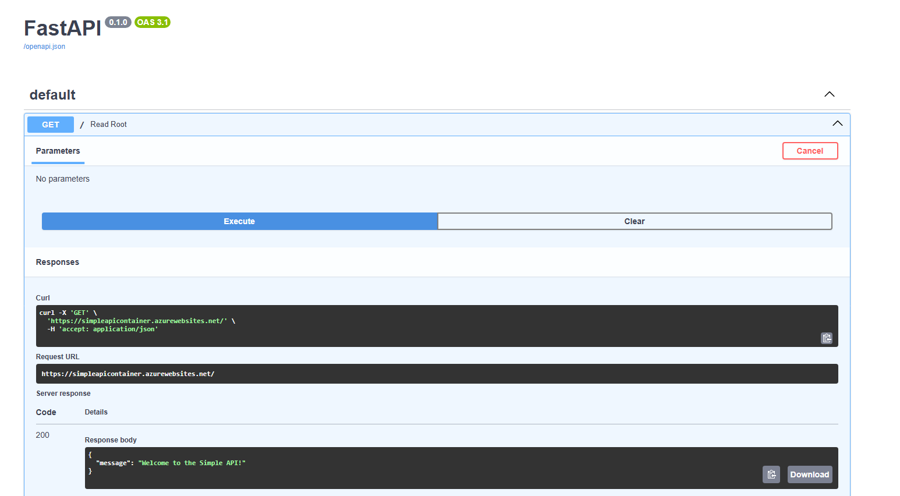

# Deploy Simple Container API Example

## Creating resources. 
The `create_resources.sh` script automates the creation of the resource group, service plan, and web app. There are some settings that the command does not update.

**Creating a resource group**

```bash
az group create --name SimpleApiRG --location brazilsouth
```

**Creating the service plan**
```bash
az appservice plan create --name SimpleApiPlan --resource-group SimpleApiRG --sku S1 --is-linux
```

**Creating the webapp**

```bash
az webapp create --name simpleapicontainer --resource-group SimpleApiRG --plan SimpleApiPlan -i <repository/image-name> -s <username> -w <password> 
```



* Registry Source: The registry from which the image will be pulled. 
* Repository Access: This enables credentials to access the Registry
    * Login: The username
    * Password: Password.

* Full Image Name and Tag: Image name in format `<namespace>/<image-name>:tag`

## Results
In the browser we can see the following:

