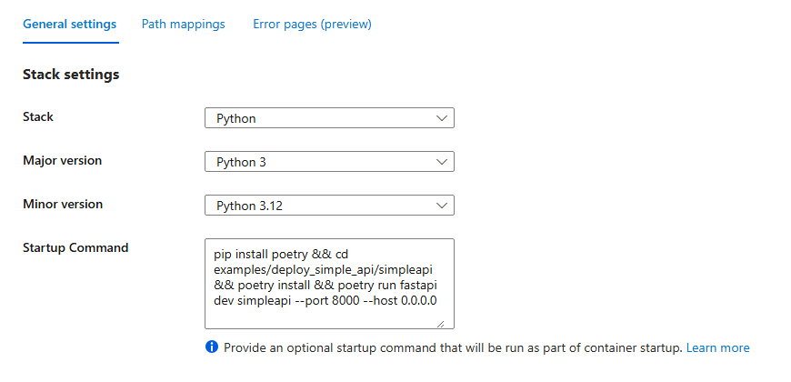

# Deploy Simple API Example

## Creating resources. 
The `create_resources.sh` script automates the creation of the resource group, service plan, and web app. Note that connecting the web app to the GitHub repository must be performed manually.

## Configuring the setup command
Ensure that the **Setup Command** field is configured accurately. An incorrect setup command may prevent the application from starting as expected.

