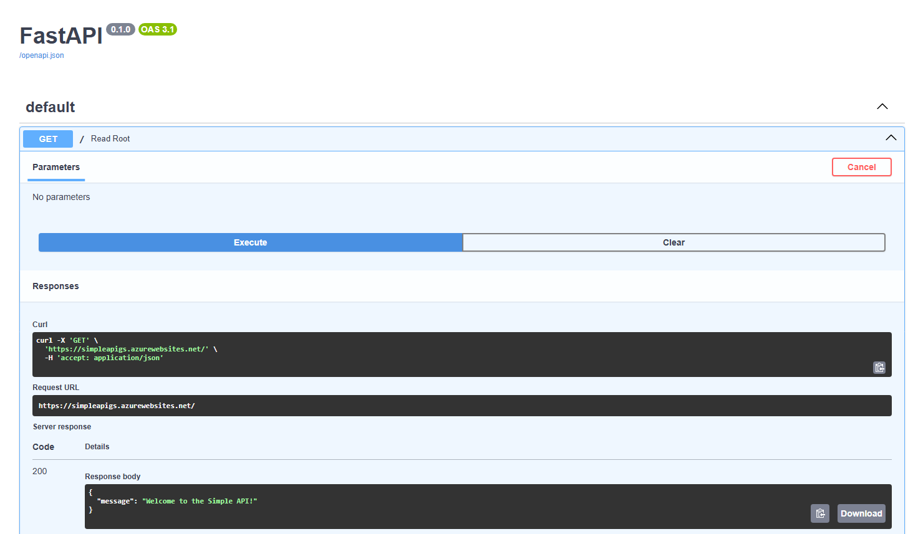

# Deploy Simple API Example

## Creating resources. 
The `create_resources.sh` script automates the creation of the resource group, service plan, and web app. Note that connecting the web app to the GitHub repository must be performed manually.

**create resource group for the Simple API deployment**
```bash
az group create --name SimpleApiRG --location brazilsouth
```

**create service plan for the simple API**

```bash
az appservice plan create --name SimpleApiPlan --resource-group SimpleApiRG --sku S1 --is-linux
```

**create web app for the simple API** 
```bash
az webapp create --name simpleapigs --resource-group SimpleApiRG --plan SimpleApiPlan --basic-auth Enabled --runtime "Python:3.12" 
```

## Configuring the setup command
Ensure that the **Setup Command** field is configured accurately. An incorrect setup command may prevent the application from starting as expected.


The command is: 
```bash
pip install poetry && \
cd examples/deploy_simple_api/simpleapi && \
poetry install && \
poetry run fastapi dev simpleapi --port 8000 --host 0.0.0.0
```

**Results**
In the browser we can see the following:

