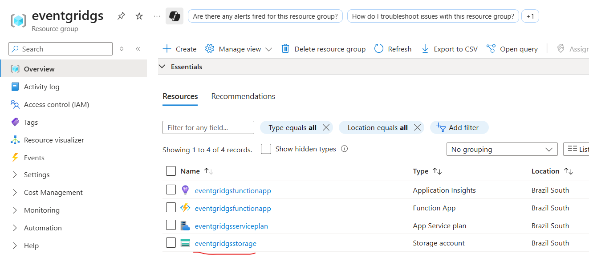
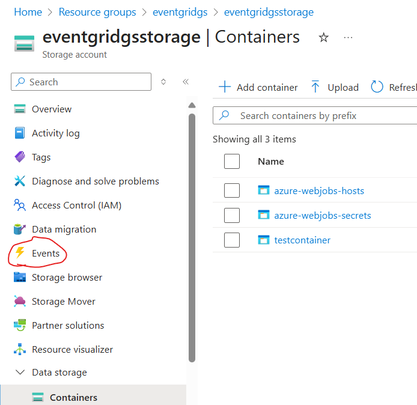
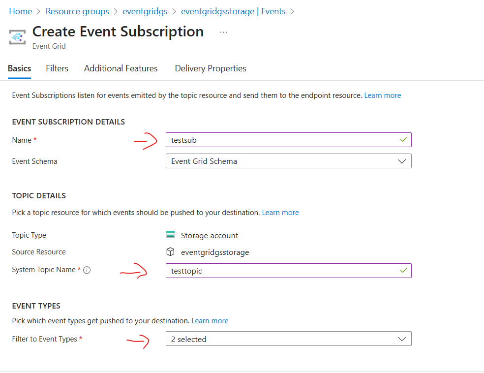
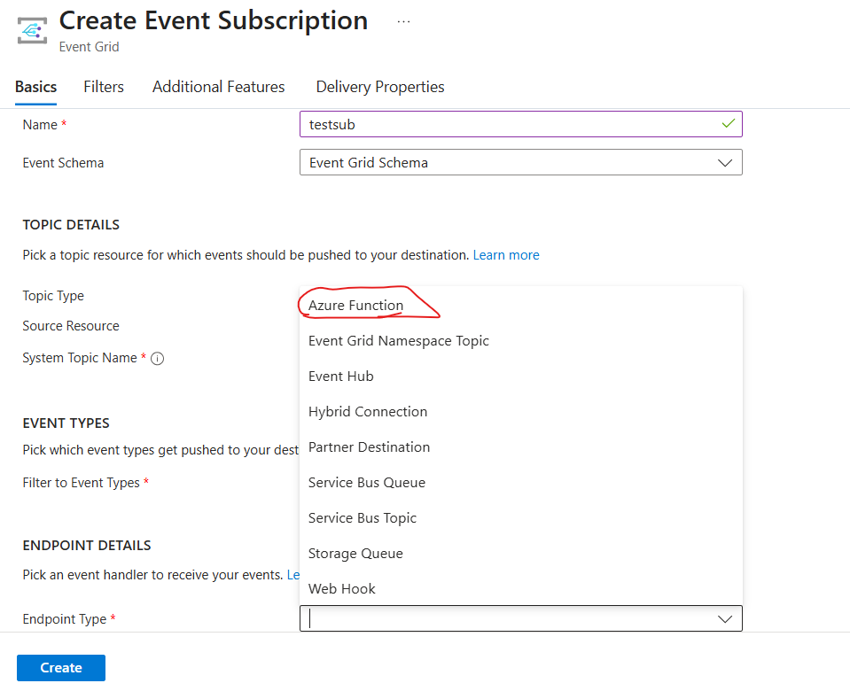
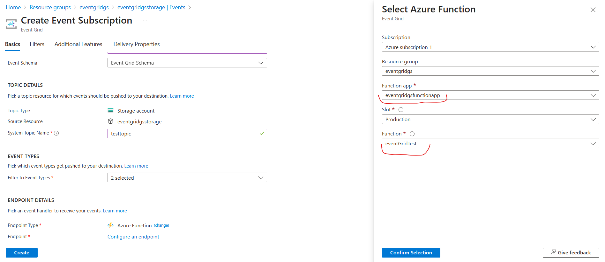

# Triggering Azure App functions based on a blob event. 

[TO DO]
## Commands to run to create the resources.

To create the resource it is necessary to execute the script `storage_account_demo.sh`.

* **Creating a resource group** 

```bash
az group create --name $rg_name --location $location
```

* **Creating a storage account** 

```bash
az storage account create --name $storage_account_name --resource-group $rg_name --location $location --sku Standard_LRS
```

* **Creating a container**

This is the container that we will use to upload blobs and trigger the function.

```bash
az storage container create --name $storage_container_name --account-name $storage_account_name
```

* **Creating a service plan** This is needed for the function app.

```bash
az appservice plan create --name $service_plan_name --resource-group $rg_name --sku S1 --is-linux
```
* **Creating the function app** 

```bash
az functionapp create \
    --name $function_app_name \
    --storage-account $storage_account_name \
    --plan $service_plan_name \
    --resource-group $rg_name \
    --runtime python \
    --runtime-version 3.12 \
```

* **Creating the function app locally**
```bash
func new \
    --name $function_app_name \
    --language python \
    --template eventgrid_trigger \
    --worker-runtime python \
```
The previous command will create the necessary files to create the function app. Since we want to trigger this function using a blob event, the template needs to be eventgrid_trigger

* **Publishing local function**

```bash
func azure functionapp publish $function_app_name
```
## Event Configuration (Using the UI)

The next configuration shows how to configure the event grid to trigger the az function given a blob event.



Go to the storage account page and go to **Events**:



On the events page, click **+ Event Subscription** To create new subscription



By default the event types are **Blob Created** and **Blob Deleted**. That's what we need!

**Endpoint Details**
Here we are going to configure the event subscription to trigger the Azure function, or the "Handler" which will do something based on the event.



Let's use Endpoint Type Azure Function. Now there is an option to configure an endpoint, click there. If everything went well during the execution of the script, the configuration will be automatically populated with information about the function that we create before.



Confirm the selection and click on create! After a few minutes you can upload some files to your container, this will triggered the azure function.


